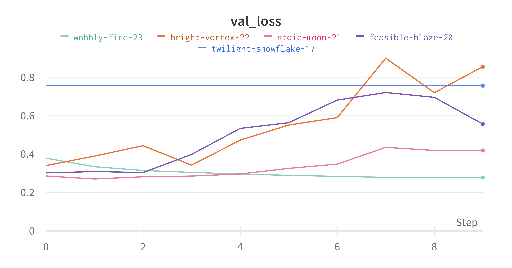
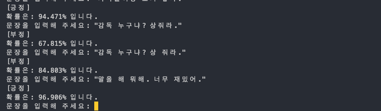

# Naver Movie Sentiment Classification

# Training Environment

## Data Set: Naver Movie Sentiment

## Model: BERT-KOR-BASE

[https://huggingface.co/kykim/bert-kor-base](https://huggingface.co/kykim/bert-kor-base)

## Resources: Geforce RTX 3090 x 4

# 코드 설명

[https://teddylee777.github.io/huggingface/bert-kor-text-classification/](https://teddylee777.github.io/huggingface/bert-kor-text-classification/)

를 참고하여 구현하였습니다. 

참조 repository: [https://github.com/11291996/developing/tree/main/projects/machine learning/nlp/naver_bert_sentiment](https://github.com/11291996/developing/tree/main/projects/machine%20learning/nlp/naver_bert_sentiment)

### Train.py

라이브러리 import

```python
import os
import numpy as np
import torch
import torch.nn as nn
import torch.optim as optim
import torch.nn.functional as F
#eliminate warnings
os.environ["TOKENIZERS_PARALLELISM"] = 'true'
```

Pandas로 data import

```python
#importing data 
import pandas as pd
train = pd.read_csv('./data/ratings_train.txt', sep='\t')
test = pd.read_csv('./data/ratings_test.txt', sep='\t')
```

Parameter 설정

```python
BATCH_SIZE = 32
lr = 1e-5
num_epochs = 10
divide = 5
data_size = train.shape[0]//divide
portion = 1/divide #20% in this run
model_name = f'b:{BATCH_SIZE},e:{num_epochs},s:{data_size},lr:{lr}'
```

데이터 정리, 길이가 짧은 데이터를 삭제하였습니다.

Naver Corpus의 총 길이는 14만개정도로 training하는데 오래걸리기에 sampling을 적용하였습니다.

Sampling의 정도 또한 training hyperparameter로 작용할 것 입니다. 

```python
train['length'] = train['document'].apply(lambda x: len(str(x)))
test['length'] = test['document'].apply(lambda x: len(str(x)))
train = train.loc[train['length'] > 5] #getting more than 5 length of sentences
train = train.sample(data_size)
test = test.loc[test['length'] > 5]
test = test.sample(data_size)
```

BERT model의 input입니다

```python
dict_keys(['input_ids', 'attention_mask', 'token_type_ids'])
```

model, tokenizer and weight import. 토크나이저 dataset를 구성할때 import 되었습니다. 

```python
CHECKPOINT_NAME = 'kykim/bert-kor-base'
tokenizer_pretrained = CHECKPOINT_NAME

self.tokenizer = BertTokenizerFast.from_pretrained(tokenizer_pretrained)
from transformers import BertModel
model_bert = BertModel.from_pretrained(CHECKPOINT_NAME)
```

Optimizer 설정, AdamW가 사용되었습니다. 

```python
optimizer = optim.AdamW(bert.parameters(), lr=lr)
```

accelerate, wandb 설정

```python
train_loader, test_loader, loss_fn, optimizer, bert =\ 
accelerator.prepare(train_loader, test_loader, loss_fn, optimizer, bert)

if accelerator.is_local_main_process:
        wandb.init(
        # set the wandb project where this run will be logged
        project="LIS8040 BERT Sentiment Analysis",

        # track hyperparameters and run metadata
        config={
        "learning_rate": lr,
        "batch_size": batch_size,
        "architecture": "KoBERT",
        "dataset": "Naver Sentiment Movie Corpus",
        "epochs": num_epochs,
        "portion": portion,
        })
```

저장 알고리즘 설정

```python
if val_loss < min_loss:
            accelerator.print(f'[INFO] val_loss has been improved from {min_loss:.5f} to {val_loss:.5f}. Saving Model!')
            min_loss = val_loss
            accelerator.save_model(bert, f'./check_point/{model_name}')
```

## Training 결과



[Training 설명](./readme/result.csv)

## Insight

실제로 BERT의 구조를 경험해볼 수 있었습니다. 확실히 hidden state의 dimension이 768개로 BERT small의 사이즈와 같았고, 실제 실습에선 attention mask를 통해 512 input size에 맞춰 padding을 해야만하고 BERT가 구현한 segment vector가 tokenizer를 통해 구현 된 것을 확인 했습니다. 

학습에 있어선 배치 사이즈가 크며 사용 sample의 사이즈가 크고 lr가 작을 때 val loss가 안정적으로 계속 감소하는 것을 확인 할 수 있었습니다. 

BERT는 encoder 기반이기 때문에 확실히 sentiment analysis 같은 task에 강한 것을 실제 모델을 사용하여 확인할 수 있었습니다.

